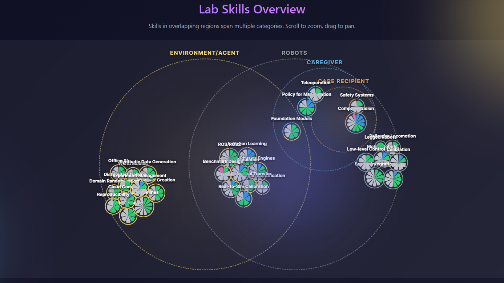

<div align="center">
  
  <h1>RoboSkills</h1>
  <h3>Robotic Skill Visualization & Analysis Platform</h3>
  
  <p>
    An interactive, data-driven dashboard for visualizing robotic capabilities, <br />
    analyzing skill gaps, and managing expertise distribution.
  </p>

  <br />
  
  <br />

  <p>
    <a href="https://whats2000.github.io/RoboSkills/">Live Demo</a> •
    <a href="#features">Features</a> •
    <a href="#tech-stack">Tech Stack</a> •
    <a href="#getting-started">Getting Started</a> •
    <a href="#license">License</a>
  </p>
</div>

---

## 🚀 Overview

**RoboSkills** is a cutting-edge web application designed to bridge the gap between complex robotic data and actionable insights. By leveraging advanced visualization techniques—including forced-directed graphs and Venn diagrams—it provides a clear map of skill dependencies, overlaps, and critical gaps in robotic development.

## ✨ Key Features

- **📊 Interactive Skill Chart**
  - Visualize complex relationships with dynamic D3.js Venn diagrams.
  - Explore skill clusters using interactive force-directed graphs.
- **📉 Gap Analysis Engine**
  - Identify missing capabilities with precision.
  - Visualize expertise distribution (`Novice` to `Expert`) across different domains.

- **🎨 Modern User Interface**
  - Built with **Ant Design** and **Tailwind CSS** for a sleek, glassmorphism-inspired aesthetic.
  - Fully responsive layout ensuring a seamless experience on all devices.

## 🛠️ Tech Stack

Built with modern, high-performance technologies:

| Category       | Technology                                                                                                    | Description                         |
| :------------- | :------------------------------------------------------------------------------------------------------------ | :---------------------------------- |
| **Framework**  |                     | Frontend library for building UIs   |
| **Language**   |       | Typed superset of JavaScript        |
| **Build Tool** |                         | Next Generation Frontend Tooling    |
| **Styling**    |  | Utility-first CSS framework         |
| **Components** |       | Enterprise-class UI design language |
| **Data Viz**   |                      | Dynamic data visualization library  |

## 🏁 Getting Started

Follow these steps to set up the project locally.

### Prerequisites

- **Node.js** (v18+ recommended)
- **npm** or **yarn**

### Installation

1.  **Clone the repository**

    ```bash
    git clone https://github.com/your-username/robotic-skill-visualize.git
    cd robotic-skill-visualize
    ```

2.  **Install dependencies**

    ```bash
    npm install
    # or
    yarn install
    ```

3.  **Start the development server**

    ```bash
    npm run dev
    # or
    yarn dev
    ```

4.  **Explore**
    Open `http://localhost:5173` in your browser to view the app.

## 🎨 Customization

**RoboSkills** is designed to be easily adaptable for your own lab, company, or team.

### using Your Own Data

The application drives its visualizations from a central JSON file. To use your own data:

1.  Navigate to `public/data/skillsData.json`.
2.  Update the `members` array with your team's information.
3.  Modify the `skills` array to reflect the specific competencies you want to track.

The application will automatically reflect these changes in the Skill Chart and Gap Analysis dashboards.

### ✨ Visual Data Editor

We provide a built-in visual tool to help you generate the necessary JSON Structure for adding members or skills!

1.  Start the application (`npm run dev`)
2.  Navigate to the **Update Data** page (e.g., `http://localhost:5173/update`)
3.  Use the form to add members, skills, and generate the JSON snippet
4.  Copy the generated JSON into your `public/data/skillsData.json` file

## 📦 Building for Production

To generate a production-ready build:

```bash
npm run build
```

The output will be optimized and placed in the `dist` directory.

## 📄 License

This project is licensed under the terms of the [LICENSE](./LICENSE) file.

## 👏 Third Party Licenses

This project incorporates code from external libraries. We thank the authors for their work:

- **[d3-venn](https://github.com/christophe-g/d3-venn)** by Christophe Geiser (BSD 3-Clause License)
- **[venn.js](https://github.com/benfred/venn.js)** by Ben Frederickson (MIT License)
- **[spa-github-pages](https://github.com/rafgraph/spa-github-pages)** by Rafael Pedicini (MIT License)
